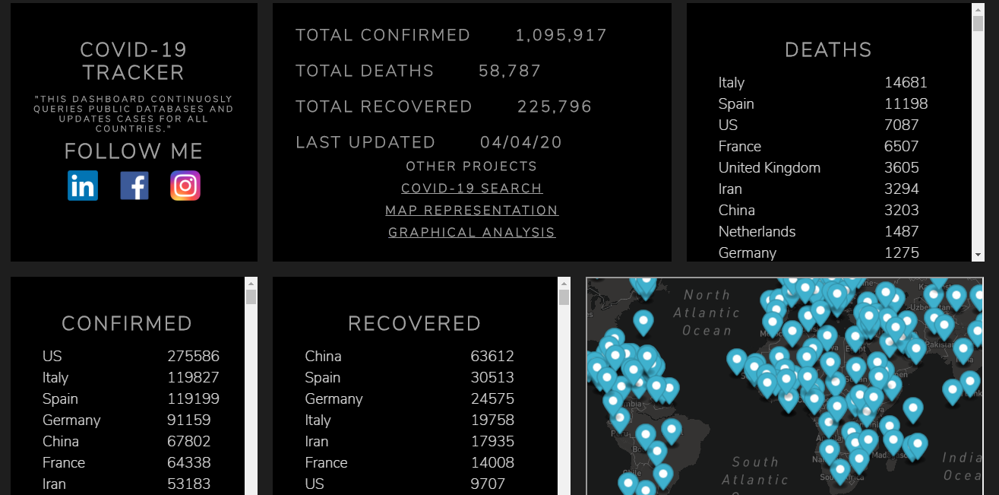

<h1 align="center">Covid-19-Dashboard</h1>
<a href="#">
  <div align="center">
    
  </div>
</a> 
THIS DASHBOARD CONTINUOUSLY QUERIES PUBLIC DATABASES AND UPDATES CASES FOR ALL COUNTRIES.[Live Demo](http://covid19dshbrd.herokuapp.com)


[](#)
[](#)
[](https://github.com/saadhaxxan/Covid-19-Dashboard/fork)
[](https://github.com/saadhaxxan/Covid-19-Dashboard/issues)
[](#)

# What is in this Project
- Daily updates about Corona Virus Cases Globally
- Separate Data about each country in table format
- Graphical Analysis of the most ten affected countries
- Corona Growth rate analysis in Pakistan with respect to date.
- A search Engine to find the most revelent Corona Virus Related Research Papers.
- Map Representation of Corona Cases across the Globe

## Resources
Search engine for bibliography related to covid-19 from: 
- COVID-19 Open Research Dataset (CORD-19). 2020. Version 2020-03-13. Retrieved from https://pages.semanticscholar.org/coronavirus-research. Accessed 2020-03-23. doi:10.5281/zenodo.3715506
- Data Access for Corona Cases https://github.com/CSSEGISandData/COVID-19
- Data for Map Representation from https://github.com/pomber/covid19


# Installation

Goto cmd/command line in your computer and type
```
git clone https://github.com/saadhaxxan/Covid-19-Dashboard.git
cd Covid-19-Dashboard
pip install -r requirements.txt
python app.py
```

## Deployment on heroku

```
cd project
git init
heroku create
heroku git:remote -a herokuappname
git add .
git commit -am "make it better"
git push heroku master
```


## Author
You can get in touch with me on my LinkedIn Profile:

#### Saad Hassan
[](https://www.linkedin.com/in/saadhaxxan)

You can also follow my GitHub Profile to stay updated about my latest projects: [](https://github.com/saadhaxxan)

If you liked the repo then kindly support it by giving it a star ⭐!

If you find any bug in the code or have any improvements in mind then feel free to generate a pull request.

## Issues
[](https://www.github.com/saadhaxxan/Covid-19-Dashboard/issues)

If you face any issue, you can create a new issue in the Issues Tab and I will be glad to help you out.
